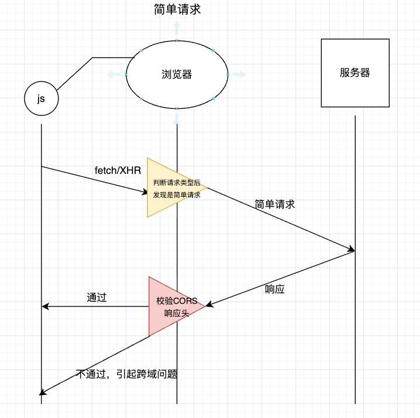
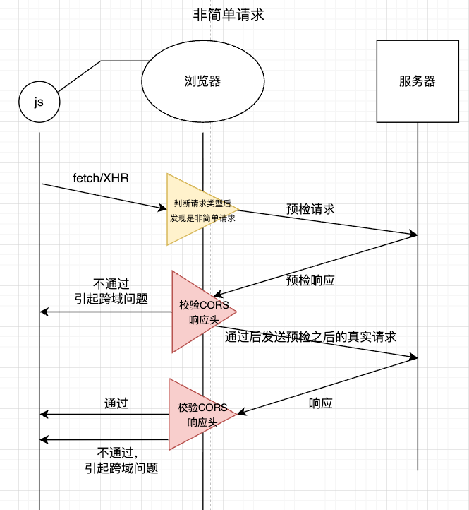
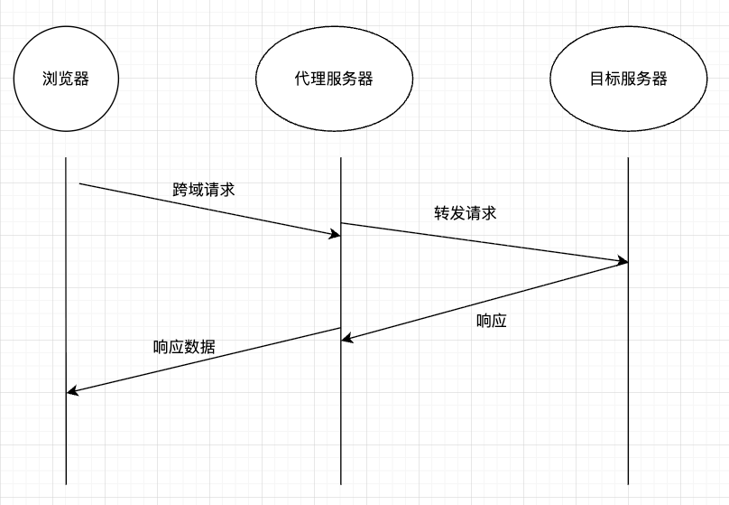

# 跨域及其解决办法

# 一、什么是浏览器同源策略：
同源策略是浏览器的核心安全规则
浏览器同源策略是，只有**协议**、**域名**、**端口**，三者一致时，属于同源，否则属于不同源
🌰：

| 判定维度 | 说明（以 `http://www.example.com:8080/page` 为例）                                                        |
| ---- | -------------------------------------------------------------------------------------------------- |
| 协议   | 必须完全相同（`http` 和 `https`协议不同，则不同源）                                                                  |
| 域名   | 必须完全相同（ `blog.example.com` 和`example.com`域名不同，则不同源）                                                |
| 端口   | 必须完全相同（默认端口 `80`/`443` 可省略； `http://www.example.com:80`，与 `http://www.example.com:8080` 端口不同，则不同源） |

来个小测试，判断二者是否同源：
- `http://www.a.com` 与 `http://www.a.com/api`
- `http://www.a.com` 与 `https://www.a.com`
- `http://www.a.com` 与 `http://blog.a.com`
- `http://www.a.com:8080` 与 `http://www.a.com:80`：

答案：
- 同源（协议、域名、端口均一致）
- 不同源（协议不同：`http` vs `https`）
- 不同源（域名不同：`www.a.com` vs `blog.a.com`）
- 不同源（端口不同：`8080` vs `80`）


# 二、什么是跨域：
它是**浏览器基于同源策略**，对不同源的页面 / 脚本未经允许相互访问数据的一个安全限制。



js发送一个请求，浏览器先接收，并判断请求类型
- 如果是简单请求，则直接发送
	服务器收到请求做出响应
	浏览器进行CORS校验，检查是否跨域
- 如果不是简单请求，则先发送预检请求
	- 预检通过，则浏览器发送真实请求，服务端返回响应，浏览器再次做CORS校验，检查是否跨域
	- 预检不通过，则会引起跨域相关问题，发生跨域报错。


## ***简单请求：***
- `GET`、`POST`、`HEAD`
- 浏览器默认的请求头或手动添加的 **安全头**（如 `DNT`、`Range` 等）
- **Content-Type 仅限 3 种**：
    - `text/plain`（纯文本）
    - `multipart/form-data`（表单文件上传）
    - `application/x-www-form-urlencoded`（普通表单提交）

响应头：Access-Control-Allow-Origin字段

## ***预检请求OPTIONS：***

当浏览器发现发送当前发送的请求不是简单请求，于是服务器先发送一个预检请求给目标服务器

```http
OPTIONS /api/submit HTTP/1.1
Origin: http://a.com  # 前端域名（跨域来源）
Access-Control-Request-Method: POST  # 即将发送的业务请求方法
Access-Control-Request-Headers: a,b,Content-Type  # 自定义的请求头
```

这就相当于告诉服务器，我这边有个http://a.com的域名，请求方法是post，它自定义了a,b,Content-Type 这是三个请求头，你看你服务端是否允许这个请求，over。
服务端收到，校验请求头里的跨域来源是否在服务器配置的白名单内，能否通过校验，后做出响应：
```http
HTTP/1.1 204 No Content
Access-Control-Allow-Origin: http://a.com  # 允许的前端域名
Access-Control-Allow-Methods: POST  # 允许的请求方法（可多个，如 "POST, PUT"）
Access-Control-Allow-Headers: Content-Type  # 允许的自定义头（需与请求头对应）
Access-Control-Max-Age: 86400  # 预检结果缓存时间（秒），在该段时间内不用每次都发送预检请求了，避免频繁预检
```
这就相当于告诉浏览器，我允许http://a.com这个域名，允许POST请求，允许Content-Type这个自定义请求头，并且在86400秒内，该来源发送的请求你浏览器不用再重复发送预检请求了，直接发送真实的请求就行了。

**注意：**
-  服务器不会判断请求是否同源，而是**检测**请求是否在服务器配置的白名单内
- 浏览器会判断要请求的服务器地址是否和当前地址同源
	- 同源：就不会在请求头中携带origin字段；
	- 不同源：就会在请求中携带origin：https://xxxxxx.com这样的信息
- 服务端收到请求后，如果发现请求头中没有origin，则默认按同源处理，返回响应中也不会携带Access-Control-Allow-Origin，如果发现请求头中有origin，则回去拿orign的地址在白名单里匹配校验：
	- 校验通过：在响应头中添加 `Access-Control-Allow-Origin`（值为请求的 `Origin` 或通配符 `*`），同时可能添加其他 CORS 头（如 `Access-Control-Allow-Methods`、`Access-Control-Allow-Credentials`）。
	- 校验失败：不返回任何 CORS 头（或返回 `Access-Control-Allow-Origin: null`），浏览器收到响应后会触发跨域错误（`No 'Access-Control-Allow-Origin' header is present`）。


# 三、为什么要有同源策略
同源策略使得浏览器环境更加安全，保护用户信息。

举个实际的例子：
若没有浏览器的同源策略，你在银行网站（`https://bank.com`）登录后，浏览器会保存银行的登录 Cookie；此时若你又打开了一个恶意网站（`https://hack.com`），该网站就能通过 JS 读取银行的 Cookie，冒充你的身份操作银行账户 —— 这会导致严重的安全风险。

# 四、非同源有哪些限制

1. **不能共享非同源页面的cookie/localstorage**
		场景：当我们在一些拥有多个子域名的网站上时，例如淘宝网站，我们如果在一个子域名(https://www.taobao.com/)中，跳转到另一个子域名(https://tbzb.taobao.com/)中，如果没有解决跨域，那么第一个子域名网页中的cookie和localstorage就不能让另一个子域名共享了。也就是说如果我们在淘宝首页登录了，跳转到淘宝直播页面中，就需要重新登录了。
2. **不能操作非同源页面的dom**
		场景：我们想在页面A中播放不同源页面B中的视频，如果我们想在页面A中改变视频的播放设置（大小、是否循环等），是不被允许的。
3. **网络请求时，不能请求非同源地址的资源**
		场景：我们在写前后端分离的项目中，前端向后端发送网络请求，二者的地址通常是不同源的。如果不解决跨域，前端就不能请求后端服务器的数据了


# 五、跨域的解决方法有哪些

## 1、JSONP

核心原理：
**利用 `<script>` 标签不受浏览器同源策略限制**的特性，通过动态创建 `<script>` 标签加载后端接口，实现跨域数据交互。

**script标签的工作机制：**
当浏览器遇到 `<script> `标签时，它会：
   - 下载 src 指向的内容
   - 将内容当作 JavaScript 代码执行
   - 如果内容不是有效的 JavaScript，就会报语法错误

下面我们用代码模拟一下
前端：
```html
<!DOCTYPE html>
<html lang="en">
  <head>
    <meta charset="UTF-8" />
    <meta name="viewport" content="width=device-width, initial-scale=1.0" />
  </head>
  <body>
    <button onclick="fetchData()">点击获取跨域数据</button>

    <script>
      // 1. 定义全局回调函数（后端返回的内容会执行此函数）
      function jsonpCallback(data) {
        // 处理后端返回的跨域数据
        console.log("收到跨域数据：", data);
        // 移除动态创建的 <script> 标签
        const script = document.getElementById("jsonp-script");
        if (script) document.body.removeChild(script);
      }

      // 2. 动态创建 <script> 标签，发起 JSONP 请求
      function fetchData() {
        // 生成唯一回调函数名（可选，避免多个 JSONP 请求冲突）
        const callbackName = `jsonpCallback_${Date.now()}`;
        // 将回调函数挂载到 window 上（必须全局，否则 <script> 执行时找不到）
        window[callbackName] = function (data) {
          // 调用全局函数
          jsonpCallback(data);
          // 执行后删除全局函数（避免污染 window）
          delete window[callbackName];
        };

        // 3. 创建 <script> 标签，指向后端 JSONP 接口
        const script = document.createElement("script");
        script.id = "jsonp-script";
        // 后端接口地址 + 回调函数名参数（关键：告知后端用哪个函数包裹数据）
        const backendUrl = `http://localhost:3000/api/jsonp?callback=${callbackName}`;
        script.src = backendUrl;

        // 4. 处理请求失败（如网络错误、后端无响应）
        script.onerror = function () {
          alert("JSONP 请求失败");
          delete window[callbackName]; // 清理全局函数
          document.body.removeChild(script);
        };

        // 5. 将 <script> 标签插入页面, 触发请求
        document.body.appendChild(script);
      }
    </script>
  </body>
</html>
```

服务端：
创建一个server.js，注意要安装node js
```javascript

const express = require('express');
const app = express();
const port = 3000; // 后端端口（与前端页面端口不同，模拟跨域）

// 核心：JSONP 接口实现
app.get('/api/jsonp', (req, res) => {
  // 1. 从 URL 参数中获取前端传递的回调函数名（对应前端的 callback=xxx）
  const callbackName = req.query.callback;

  // 2. 模拟要返回给前端的业务数据（实际场景可能从数据库/接口获取）
  const responseData = {
    username: '张三',
    age: 25,
    desc: '这是通过 JSONP 跨域返回的数据',
    success: true
  };

  // 3. 关键：将数据包裹在回调函数中，格式为 "回调函数名(数据)"
  // 注意：数据需转为 JSON 字符串，否则会被当作 JS 对象直接拼接（可能报错）
  const jsonpResponse = `${callbackName}(${JSON.stringify(responseData)})`;

  // 4. 设置响应头（可选，但建议明确 Content-Type）
  res.setHeader('Content-Type', 'application/javascript; charset=utf-8');

  // 5. 返回 JSONP 格式的响应（前端 <script> 会执行此内容）
  res.send(jsonpResponse);
});

// 启动后端服务
app.listen(port, () => {
  console.log(`JSONP 后端服务已启动：http://localhost:${port}`);
});

// 开启后端服务器的指令
// node server.js
// 注意server.js文件路径，要从根目录开始算
```

**JSONP 的巧妙之处：**
1. 利用 `<script>` 可以跨域的特性
2. 服务器返回可执行代码而不是数据，js遇到script标签，自动执行
3. 通过函数调用的方式传递数据

**服务端返回的数据：**
```
callbackName(
	{
		username: '张三',
		age: 25,
		desc: '这是通过 JSONP 跨域返回的数据',
		success: true
	}
)
```

**注意：**
- 只支持 GET 请求
- 安全性相对较低（需要信任服务器返回的代码）
- 错误处理相对有限


## 2、window.postMessage()
`核心`：发送方主动发消息 + 接收方监听消息  , 这样就可以获取不同源页面的数据了.

创建a.html

```html
<!DOCTYPE html>
<html lang="en">
  <head>
    <meta charset="UTF-8" />
    <meta name="viewport" content="width=device-width, initial-scale=1.0" />
    <title>Document</title>
  </head>
  <body>
    <iframe
      id="iframe"
      src="http://www.domain2.com/b.html"
      style="display: none"
    ></iframe>
    <script>
      var iframe = document.getElementById("iframe");
      iframe.onload = function () {
        // 向domain2传送跨域数据
        iframe.contentWindow.postMessage(JSON.stringify('hello, I am a'),"http://www.domain2.com");
      };

      // 接受domain2返回数据
      window.addEventListener("message",function (e) {
          alert("data from domain2 ---> " + e.data);
      },false);

    </script>
  </body>
</html>

```
创建b.html

```html
<!DOCTYPE html>
<html lang="en">
<head>
    <meta charset="UTF-8">
    <meta name="viewport" content="width=device-width, initial-scale=1.0">
    <title>Document</title>
</head>
<body>
    <script>
        // 接收domain1的数据
        window.addEventListener('message', function(e) {
            alert('data from domain1 ---> ' + e.data);
        
            var data = JSON.parse(e.data);
            if (data) {
                data.number = 16;
        
                // 处理后再发回domain1
                window.parent.postMessage(JSON.stringify(data), 'http://www.domain1.com');
            }
        }, false);
    </script>
</body>
</html>
```

`window.postMessage()` 是最灵活的跨域页面通信方案，尤其适合 iframe 或多窗口场景,但自身需做好安全检验，防止恶意攻击。

## 3、document.domain

**核心原理：**
当两个页面主域名相同，子域名不同时，两个页面都通过js强制手动设置document.domain为相同					的主域名，以此实现同域。
创建一个a.html,模拟它来自a.example.com

```html
<!DOCTYPE html>
<html>
<head>
  <meta charset="UTF-8">
  <title>a.example.com（父页面）</title>
</head>

<body>
  <h1>父页面：a.example.com:8080</h1>
  <!-- 嵌入 b.example.com 的子页面（iframe 实现跨域页面嵌套） -->
  <iframe id="iframe" src="http://domain.com/index1.html" width="800" height="300"></iframe>
  <br>
  <button onclick="readBPageCookie()">读取 b.example.com 的 Cookie</button>
  <div id="cookieResult"></div>

  <script>
    document.domain = 'example.com';
    // 读取子页面（b.example.com）的 Cookie 的操作
    ...
  </script>
</body>
</html>
```
创建一个b.html,模拟它来自b.example.com

```html
<!DOCTYPE html>
<html>
<head>
  <meta charset="UTF-8">
  <title>b.example.com（子页面）</title>
</head>
<body>
  <h2>子页面：b.example.com:8081</h2>
  <p>已设置 Cookie：username=zhangsan（domain=.example.com）</p>

  <script>
    document.domain = 'example.com';
  </script>
</body>
</html>
```

**为什么能手动设置？**
`document.domain` 是浏览器提供的一个特殊属性，可获取或设置当前页面的域名。其核心功能是：**允许页面主动声明自身的 “域名标识”，用于同源判定**，而非完全依赖 URL 中的原始域名。

为什么浏览器允许这种主动声明的方式，从而绕过跨域的行为？
浏览器设计这一机制，核心是基于 **“同一主域名下的子域名，通常属于同一主体（如同一公司、同一项目），相互之间存在合理的交互需求”** 的场景
这样不同子域名之间共享cookie等信息，方便交互。

## 4、cors

CROS（跨域资源共享）解决跨域的核心原理是：让后端通过 HTTP 响应头 “授权”

**后端服务器配置以下响应头来解决跨域：**
`Access-Control-Allow-Origin`（必选）：指定允许跨域的前端域名
`Access-Control-Allow-Methods`：指定允许的请求方法
`Access-Control-Allow-Headers`：指定允许的自定义请求头
`Access-Control-Allow-Credentials`：设为 `true` 允许前端携带 Cookie/Token 跨域（此时 `Allow-Origin` 不能为 `*`）
`Access-Control-Max-Age`：预检请求结果的缓存时间

**简单请求**只需配置：`Access-Control-Allow-Origin`

CORS 是当前跨域的最优解，只需后端通过响应头配置权限，前端几乎无需修改代码，兼顾安全性和灵活性，适合绝大多数现代项目。

## 5、websocket协议解决跨域
websocket协议是一种**全双工**的通信方式，本身只支持跨域的
首先先通过http请求，服务端返回http响应，双方达成用websocket协议来通信的一致意见后，连接就完全转为 WebSocket 协议，客户端和服务器可**随时双向发送数据**了。


## 6、webpack配置代理服务器解决跨域
- 配置webpack开发服务器

```bash
npm install webpack-dev-server --save-dev
# 或者
yarn add webpack-dev-server --dev
```

- 在webpack.config.js配置文件中配置代理

```javascript
module.exports = {
  devServer: {
    // 本地服务器端口
    port: 3000, 
    proxy: {
      // 匹配请求路径，这里以 /api 开头的请求都会被代理
      '/api': { 
        target: 'http://backend.com:8080', // 目标服务器地址
        changeOrigin: true, // 发送请求时是否保留原主机头
        pathRewrite: {
          '^/api': '' // 去掉请求路径中的/api前缀
        }
      }
    }
  }
};
```
这就相当于配置了前端贝蒂开发服务器：`http://localhost:3000`（webpack-dev-server 启动的服务器）
前端要请求的后端接口：`http://backend.com:8080/user/list`
- 前端发送请求：**axios.get('/api/user/list')**
由于前端页面运行在`http://localhost:3000`，相对路径会拼接当前域名，所以实际请求的url是：`http://localhost:3000/api/user/list`
- `/api`前缀触发webpack-dev-server 拦截并转发请求
	- 路径重写：根据pathRewrite，把/api前缀去掉，得到`/user/list`
	- 转发到目标服务器：将请求转发到target配置的后端服务器，最终转发的 URL 为：
`http://backend.com:8080/user/list `
- 后端服务器接收请求并返回响应
	- 后端服务器`http://backend.com:8080`收到请求后，处理并返回数据给 webpack-dev-server，再由 webpack-dev-server 返回给浏览器。



跨域及其解决办法就讲到这里了，有问题的可以在评论区提出来哦，欢迎大家共同交流。
✿✿ヽ(°▽°)ノ✿